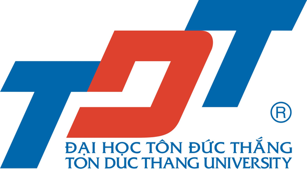
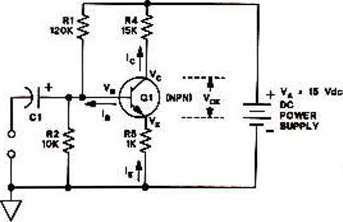

TỔNG LIÊN ĐOÀN LAO ĐỘNG VIỆT NAM
**TRƯỜNG ĐẠI HỌC TÔN ĐỨC THẮNG** 
**KHOA CÔNG NGHỆ THÔNG TIN** 

**NGUYỄN VĂN NAM**

# TÊN ĐỀ TÀI LUẬN VĂN THẠC SĨ

**Chuyên ngành:** ỨNG DỤNG CHÉM GIÓ

**Mã ngành:** 12345

**THÀNH PHỐ HỒ CHÍ MINH, THÁNG … NĂM ….**

<table class="no-border-table column-50-50">
    <tr>
        <td>Công trình được hoàn thành tại:</td>
        <td>Trường Đại học Tôn Đức Thắng</td>
    </tr>
    <tr>
        <td>Cán bộ hướng dẫn khoa học:</td>
        <td>TS. Nguyễn Văn A 
            Trường đại học A
        </td>
    </tr>
    <tr>
        <td>Cán bộ phản biện 1:</td>
        <td>TS. Nguyễn Văn B 
            Trường đại học B
        </td>
    </tr>
    <tr>
        <td>Cán bộ phản biện 2:</td>
        <td>TS. Nguyễn Văn C 
            Trường đại học C
        </td>
    </tr>
</table>
Luận văn thạc sĩ được bảo vệ tại Trường Đại học Tôn Đức Thắng vào ngày… tháng… năm….theo Quyết định số…/…/TĐT-QĐ ngày …/…/…
Thành phần Hội đồng đánh giá luận văn thạc sĩ gồm:
<table class="no-border-table column-50-50">
    <tr>
        <td>1. GS.TS. Nguyễn Văn D</td>
        <td>Trường Đại học Tôn Đức Thắng</td>
    </tr>
    <tr>
        <td>2. TS. Nguyễn Văn B</td>
        <td>Trường Đại học B</td>
    </tr>
    <tr>
        <td>3. TS. Nguyễn Văn C</td>
        <td>Trường Đại học C</td>
    </tr>
    <tr>
        <td>4. TS. Nguyễn Văn E</td>
        <td>Trường Đại học E</td>
    </tr>
    <tr>
        <td>5. TS. Nguyễn Văn F</td>
        <td>Trường Đại học F</td>
    </tr>
</table>
Xác nhận của Chủ tịch hội đồng đánh giá luận văn và Trưởng khoa quản lý chuyên ngành sau khi nhận luận văn đã được sửa chữa (nếu có).
<table class="no-border-table center-text column-50-50">
    <tr>
        <td>CHỦ TỊCH HỘI ĐỒNG
               
            ..................
        </td>
        <td>TRƯỞNG KHOA
               
            ..................
        </td>
    </tr>
</table>

<table class="no-border-table center-text">
    <tr>
        <td>ĐẠI HỌC TÔN ĐỨC THẮNG 
            <strong>KHOA ......</strong> 
            ..................
        </td>
        <td>CỘNG HÒA XÃ HỘI CHỦ NGHĨA VIỆT NAM 
            <strong>Độc lập – Tự do – Hạnh phúc</strong> 
            ..................
        </td>
    </tr>
</table>

**NHIỆM VỤ LUẬN VĂN THẠC SĨ**

<table class="no-border-table column-70-30">
    <tr>
        <td>Họ tên học viên:</td>
        <td>MSHV:</td>
    </tr>
    <tr>
        <td>Ngày sinh:</td>
        <td>Nơi sinh:</td>
    </tr>
    <tr>
        <td>Chuyên ngành:</td>
        <td>Mã số:</td>
    </tr>
</table>

1. Tên đề tài:
(Tên đề tài tiếng Anh)
2. Nhiệm vụ (yêu cầu về nội dung và số liệu ban đầu): 
 
 
 
 
3. Ngày giao nhiệm vụ:  …/…/…(ngày giao đề tài theo quyết định)
4. Ngày hoàn thành:  …/…/…(hạn nộp luận văn và hồ sơ xin bảo vệ)
5. Cán bộ hướng dẫn:	
Tp. HCM, ngày    tháng    năm
<table class="no-border-table center-text column-50-50">
    <tr>
        <td>TRƯỞNG KHOA</td>
        <td>CÁN BỘ HƯỚNG DẪN</td>
    </tr>
</table>

**LỜI CẢM ƠN**

Tôi xin chân thành cảm ơn …

*TP. Hồ Chí Minh, ngày   tháng   năm*      
*Tác giả*
*(ký tên và ghi rõ họ tên)*

**LỜI CAM ĐOAN**

Tôi xin cam đoan đây là công trình nghiên cứu của riêng tôi và được sự hướng dẫn khoa học của …………………………………………;. Các nội dung nghiên cứu, kết quả trong đề tài này là trung thực và chưa công bố dưới bất kỳ hình thức nào trước đây. Những số liệu trong các bảng biểu phục vụ cho việc phân tích, nhận xét, đánh giá được chính tác giả thu thập từ các nguồn khác nhau có ghi rõ trong phần tài liệu tham khảo.

Ngoài ra, trong luận văn còn sử dụng một số nhận xét, đánh giá cũng như số liệu của các tác giả khác, cơ quan tổ chức khác đều có trích dẫn và chú thích nguồn gốc.

**Nếu phát hiện có bất kỳ sự gian lận nào tôi xin hoàn toàn chịu trách nhiệm về nội dung luận văn của mình**. Trường đại học Tôn Đức Thắng không liên quan đến những vi phạm tác quyền, bản quyền do tôi gây ra trong quá trình thực hiện (nếu có).
*Tp. Hồ Chí Minh, ngày   tháng   năm*      
*Tác giả*

(ký tên và ghi rõ họ tên)

Luận văn thạc sĩ được bảo vệ tại hội đồng đánh giá luận văn thạc sĩ Trường Đại học Tôn Đức Thắng vào ngày… tháng… năm….theo Quyết định số…/…/TĐT-QĐ ngày …/…/…

**TÓM TẮT**

 
 
 
 

**ABSTRACT**

 
 
 
 

**MỤC LỤC**

DANH MỤC HÌNH VẼ	X
DANH MỤC BẢNG BIỂU	XI
DANH MỤC THUẬT NGỮ VIẾT TẮT	XII
CHƯƠNG 1.	TỔNG QUAN VỀ HỆ THỐNG….	1
1.1	GIỚI THIỆU	1
1.1.1	Tiểu mục	2
1.1.2	Lý thuyết về CDMA	2
1.1.3	Hướng nghiên cứu	2
1.2	NGUYÊN LÝ CHUNG	3
1.2.1	Nguyên lý thứ nhất	3
1.2.2	Nguyên lý thứ hai	4
1.2.3	Nguyên lý thứ ba	4
CHƯƠNG 2.	CƠ SỞ LÝ THUYẾT	5
2.1	NỘI DUNG 1	5
2.2	NỘI DUNG 2	5
CHƯƠNG 3.	PHƯƠNG PHÁP NGHIÊN CỨU	6
3.1	MÔ HÌNH MÔ PHỎNG	6
3.2	KẾT QUẢ MÔ PHỎNG	6
CHƯƠNG 4.	PHÂN TÍCH DỮ LIỆU	7
4.1	NHẬN XÉT 1	7
CHƯƠNG 5.	KẾT LUẬN	8
5.1	KẾT LUẬN	8
5.1.1	Kết luận 1	8
5.1.2	Kết luận 2	8
5.1.3	Kết luận 3	8
5.2	HƯỚNG PHÁT TRIỂN	8
TÀI LIỆU THAM KHẢO	9
PHỤ LỤC A	

## DANH MỤC HÌNH VẼ

HÌNH 1 1: MẠCH KHUẾCH ĐẠI E CHUNG	2
HÌNH 1 2: MẠCH KHUẾCH ĐẠI E CHUNG	2

## DANH MỤC BẢNG BIỂU

BẢNG 1 1: VÍ DỤ	3

## DANH MỤC THUẬT NGỮ VIẾT TẮT

(Sắp xếp theo thứ tự ABC)

<table class="no-border-table">
    <tr>
        <td>BDT</td>
        <td>Broadband Digital Terminal</td>
    </tr>
    <tr>
        <td>FFT</td>
        <td>Fast Fourier Transform</td>
    </tr>
    <tr>
        <td>MIMO</td>
        <td>Multi-Input Multi-Output</td>
    </tr>
</table>

## CHƯƠNG 1. TỔNG QUAN VỀ HỆ THỐNG…

Hướng dẫn sử dụng template (Xóa phần này sau khi hoàn chỉnh file):
a.	Mỗi phần của tài liệu đều đã được định dạng sẵn theo một trong các “Styles” (vào mục Home/ Styles và chọn style thích hợp bằng cách click vào tên style tương ứng). Các user không nên tự ý thay đổi format của bất kỳ đoạn nào
b.	 Các style cụ thể như sau:
-	Tựa chương: style Heading 1
-	Các tiểu mục cấp 1: style Heading 2
-	Các tiểu mục cấp 2: style Heading 3
-	….
-	Nội dung: style Normal
-	Các tiểu mục không đánh số (ở đầu bài thí nghiệm): style Subtitle
-	Chú thích hình vẽ và bảng biểu: style ThesisFigure hoặc ThesisTable
-	…
c.	Update mục lục sau khi thêm các tiểu mục hoặc bài mới: click mouse trên khối mục lục, click phải, chọn update field (hoặc nhấn F9).
d.	Hình vẽ soạn bằng word nên đặt trong Drawing Canvas

### 1.1 Giới thiệu

Sử dụng kiểu chữ Times New Roman (Unicode) cỡ 13 của hệ soạn thảo Winword; mật độ chữ bình thường; không được nén hoặc kéo dãn khoảng cách giữa các chữ; dãn dòng đặt ở chế độ 1.5 lines; lề trên 3.5 cm; lề dưới 3cm; lề trái 3.5 cm; lề phải 2cm. Số trang được đánh ở giữa, phía trên đầu mỗi trang giấy. Nếu có bảng, biểu, hình vẽ trình bày theo chiều ngang khổ giấy thì đầu bảng là lề trái của trang, nhưng nên hạn chế trình bày theo cách này. 

Luận văn được in trên một mặt giấy trắng, khổ A4 (210 x 297mm).

#### 1.1.1 Tiểu mục

Các tiểu mục của luận văn được trình bày và đánh số và nhóm chữ số, nhiều nhất gồm 04 chữ số với số thứ nhất chỉ số chương (Thí dụ: 4.1.2.1 chỉ tiểu mục 1, nhóm tiểu mục 2, mục 1, Chương 04). Tại mỗi nhóm tiểu mục phải có ít nhất 02 tiểu mục, nghĩa là không thể có tiểu mục 2.1.1 mà không có tiểu mục 2.1.2 tiếp theo.

#### 1.1.2 Lý thuyết về CDMA

Không lạm dụng việc viết tắt. Chỉ viết tắt những từ, cụm từ hoặc thuật ngữ được sử dụng nhiều lần trong luận văn.
Luận văn thạc sĩ không được quá 150 trang.
Footer từ trang đầu tiên của chương 1( hoặc phần mở đầu), kết thúc trang cuối của phần tài liệu tham khảo, in nghiêng, không in đậm, không để dấu chấm hết câu, không để trong dấu ngoặc kép. Ví dụ: Kết hợp vấn đề A và vấn đề B để bào vệ bản quyền tác giả

#### 1.1.3 Hướng nghiên cứu

Việc đánh số bảng biểu, hình vẽ, phương trình phải gắn với số chương (Thí dụ hình 3.4 có nghĩa là hình thứ 4 trong Chương 3). Mọi bảng biểu, đồ thị lấy từ các nguồn khác phải được trích dẫn đầy đủ (ví dụ: Nguồn: Tr.35, Tạp chí Tín dụng (2012), Số 15, NXB Tài chính, TP.HCM). Nguồn được trích dẫn phải được liệt kê chính xác trong Danh mục tài liệu tham khảo. Đầu đề của bảng, biểu ghi phía trên bảng, biểu; đầu đề của hình vẽ ghi phía dưới hình.

Hình 1 1: Mạch khuếch đại E chung (tên hình căn giữa, in đậm, không in nghiêng, để tên phía dưới hình)

Hình 1 2: Mạch khuếch đại E chung

Mọi ý kiến, khái niệm, phân tích, phát biểu, diễn đạt... có ý nghĩa, mang tính chất gợi ý không phải của riêng tác giả và mọi tham khảo khác **phải được trích dẫn và chỉ rõ nguồn trong danh mục Tài liệu tham khảo của luận văn**. Phải nêu rõ cả việc sử dụng những đề xuất hoặc kết quả của đồng tác giả (đối với công trình đã công bố khác thì phải trích dẫn bình thường như một tài liệu tham khảo). Nếu sử dụng tài liệu của người khác và của đồng tác giả (bảng biểu, hình vẽ, công thức, đồ thị, phương trình, ý tưởng...) mà không chú dẫn tác giả và nguồn tài liệu thì **luận văn không được duyệt để bảo vệ**.

Không trích dẫn những kiến thức phổ biến, mọi người đều biết tránh làm nặng nề phần tham khảo trích dẫn.

Việc trích dẫn là theo thứ tự của tài liệu ở danh mục Tài liệu tham khảo và được đặt trong ngoặc vuông, khi cần có cả số trang, ví dụ [15, tr.314-315]. Đối với phần trích dẫn từ nhiều tài liệu khác nhau, số của từng tài liệu được đặt độc lập trong từng ngoặc vuông, theo thứ tự tăng dần, ví dụ [19], [25], [41], [42].

### 1.2 Nguyên lý chung

#### 1.2.1 Nguyên lý thứ nhất

Bảng 1 1: Ví dụ (tên bảng căn giữa, in đậm, không in nghiêng, để tên phía trên bảng)

<table>
    <tr>
        <td> </td>
        <td> </td>
        <td> </td>
        <td> </td>
        <td> </td>
        <td> </td>
        <td> </td>
        <td> </td>
        <td> </td>
    </tr>
    <tr>
        <td colspan="4"> </td>
        <td colspan="4"> </td>
        <td> </td>
    </tr>
    <tr>
        <td colspan="4"> </td>
        <td colspan="4"> </td>
        <td> </td>
    </tr>
    <tr>
        <td colspan="8"> </td>
        <td> </td>
    </tr>
    <tr>
        <td colspan="4"> </td>
        <td colspan="3"> </td>
        <td> </td>
        <td> </td>
    </tr>
    <tr>
        <td colspan="8"> </td>
        <td> </td>
    </tr>
</table>

Tránh trình bày bảng/ hình một nửa ở trang trước, một nửa ở trang sau; Tránh để tên, trích dẫn nguồn không cùng trang với bảng/ hình (trừ trường hợp nội dung bảng/ hình quá dài, không thể trình bày trong một trang).

#### 1.2.2 Nguyên lý thứ hai

Tránh những lỗi chính tả thông thường như: Viết tắt không thống nhất trong luận văn (ví dụ: TP. HCM, TP.HCM, Tp.HCM..); hai khoảng trắng liên tiếp; viết hoa tên riêng; chấm câu; font chữ, size chữ (xem lại qui định mục 1.1).

Thống nhất chữ “sĩ” trong từ “thạc sĩ” dùng chữ i ngắn.

Khi in luận văn, phải kiểm tra lại chính tả, màu mực, font chữ..

Màu sắc, chất liệu bìa luận văn: HV nên đến Thư viện/ Phòng sau đại học để tham khảo màu sắc, hình thức trình bày bìa và nội dung luận văn của các luận văn trước.

#### 1.2.3 Nguyên lý thứ ba

Số chương của Luận văn tùy thuộc vào đặc tính, qui định của từng ngành/ chuyên ngành và đề tài cụ thể.

## CHƯƠNG 2. CƠ SỞ LÝ THUYẾT 

### 2.1 Nội dung 1

Luận văn thuộc một số ngành có đặc thù riêng( Khoa kỹ thuật công trình, Khoa mỹ thuật công nghiệp..) có hình thức phù hợp riêng với qui định của Khoa.

### 2.2 Nội dung 2

This is the first paragraph.

## CHƯƠNG 3. PHƯƠNG PHÁP NGHIÊN CỨU

Đây là đoạn giới thiệu chung. 

### 3.1 Mô hình mô phỏng

Đây là đoạn thứ nhất của phần 3.1.
### 3.2 Kết quả mô phỏng

Đây là đoạn thứ nhất của phần 3.2.

 
## CHƯƠNG 4. PHÂN TÍCH DỮ LIỆU

### 4.1 Nhận xét 1

## CHƯƠNG 5. KẾT LUẬN

### 5.1 Kết luận

Trình bày những kết quả của luận văn một cách ngắn gọn không có lời bàn và bình luận thêm.

### 5.1.1 Kết luận 1

Khi nộp 05 quyển luận văn cùng đơn xin bảo vệ, học viên phải hoàn thiện theo format qui định này, đóng bìa kiếng. Những phần trước chương 1/ phần mở đầu và từ phần tài liệu tham khảo trở đi có thể in 2 mặt để tiết kiệm giấy.

Sau hội đồng đánh giá luận văn, khi nội dung chỉnh sửa đã được hội đồng thông qua, học viên chỉ cần in 01 quyển bìa simili chữ mạ vàng (là quyển cuối cùng để nộp thư viện). Trước khi đặt in bìa, học viên nên tham khảo kỹ hình thức của luận văn khóa trước tại Thư viện/ Phòng sau đại học. Tất cả nội dung của quyển này in một mặt.

### 5.1.2 Kết luận 2

Lưu ý: Học viên phải kiểm tra các điều kiện để được bảo vệ luận văn trước khi nộp đơn xin bảo vệ: Hoàn tất các môn học  trong chương trình đào tạo của khóa đào tạo; điểm trung bình tích lũy từ 5.5 trở lên; có chứng chỉ triết học, anh văn theo qui định, không nợ học phí; còn hạn làm luận văn (06 tháng đối với trường hợp bình thường và 09 tháng với trường hợp gia hạn có lý do chính đáng được phê duyệt).

### 5.1.3 Kết luận 3

Đây là kết luận số 3.

### 5.2 Hướng phát triển

## TÀI LIỆU THAM KHẢO

**Tiếng Việt:**
[1] 	Quách Ngọc Ân (1992), “Nhìn lại hai năm phát triển lúa lai”, Di tuyền học ứng dụng, 98(1), tr. 10-16.
[2] 	Bộ nông nghiệp & PTNT (1996), Báo cáo tổng kết 5 năm (1992-1996) phát triển lúa lai, Hà Nội.
[3] 	Nguyễn Hữu Đống, Đào Thanh Bằng, Lâm Quang Dụ, Phan Đức Trực (1997), Đột biến – Cơ sở lý luận và ứng dụng, Nhà xuất bản nông nghiệp, Viện khoa học kỹ thuật nông nghiệp Việt Nam, Hà Nội.
[4] 	Nguyễn Thị Gấm (1996), Phát hiện và đánh giá một số dòng bất dục đực cảm ứng nhiệt độ, Luận văn thạc sĩ khoa học nông nghiệp, Viện khoa học kỹ thuật nông nghiệp Việt Nam, Hà Nội.
[5] 	……….
[6] 	Võ Thị Kim Huệ (2000), Nghiên cứu chẩn đoán và điều trị bệnh…, Luận án Tiến sĩ y khoa, Trường đại học y Hà Nội, Hà Nội.
**Tiếng Anh:**
[7] 	Anderson J.E. (1985), The Relative Inefficiency of Quota, The Cheese Case, American Economic Review, 75(1), pp. 178-90.
[8] 	Borkakati R. P.,Virmani S. S. (1997), Genetics of thermosensitive genic male sterility in Rice, Euphytica 88, pp. 1-7.
[9] 	Boulding K.E. (1955), Economics Analysis, Hamish Hamilton, London.
[10] 	Burton G. W. (1988), “Cytoplasmic male-sterility in pearl millet (penni-setum glaucum L.)”, Agronomic Journal 50, pp. 230-231.
[11] 	Central Statistical Oraganisation (1995), Statistical Year Book, Beijing.
[12] 	FAO (1971), Agricultural Commodity Projections (1970-1980), Vol. II. Rome.
[13] 	Institute of Economics (1988), Analysis of Expenditure Pattern of Urban Households in Vietnam, Departement pf Economics, Economic Research Report, Hanoi.

## PHỤ LỤC A

Phần này bao gồm những nội dung cần thiết nhằm minh họa hoặc hỗ trợ cho nội dung luận văn như số liệu, biểu mẫu, tranh ảnh. . . . nếu sử dụng những câu trả lời cho một *bảng câu hỏi thì bảng câu hỏi mẫu này phải được đưa vào phần Phụ lục ở dạng nguyên bản* đã dùng để điều tra, thăm dò ý kiến; **không được tóm tắt hoặc sửa đổi**. Các tính toán mẫu trình bày tóm tắt trong các biểu mẫu cũng cần nêu trong Phụ lục của luận văn. Phụ lục không được **dày** hơn phần chính của luận văn.
Số trang của phụ lục quay về lại dạng số La Mã, là số nối tiếp của phần số La Mã đầu luận văn.
**Phần phụ lục không để footer.**